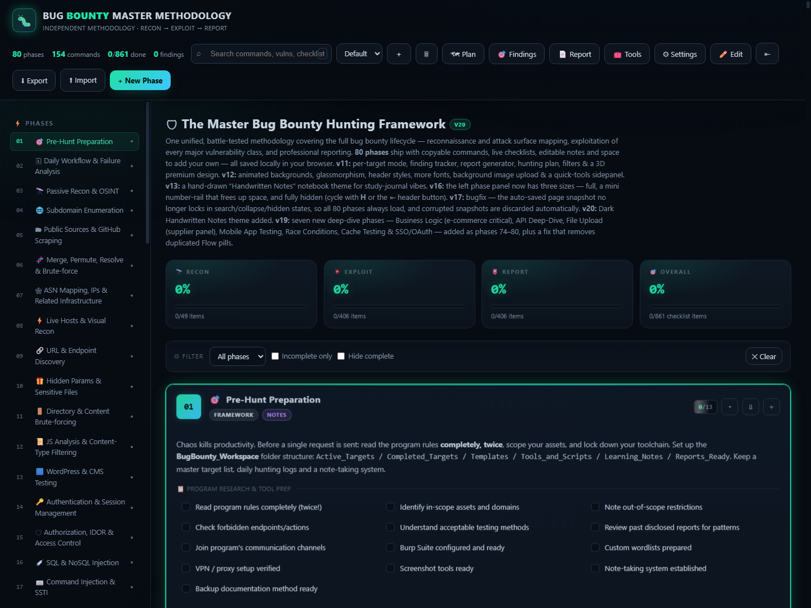

<div align="center">

# ⚡ Bug Bounty Master Methodology v20

<p align="center">
  <b>The Complete Interactive Multi-Phase Web & API Penetration Testing Checklist</b>
</p>

[](https://ramaneon.github.io/methodology/)
[](https://github.com/ramaneon/methodology)
[](LICENSE)
[](#)

<br/>



</div>

---

## 🎯 Overview

**Bug Bounty Master Methodology** is an interactive, browser-based auditing engine and tactical playbook built for bug hunters, penetration testers, and security researchers. It provides a structured, multi-phase workflow covering every stage of an engagement — from initial surface discovery to high-impact vulnerability chaining and proof-of-concept generation.

### 🌐 [🚀 Launch Interactive Web Application](https://ramaneon.github.io/methodology/)

---

## ⚡ Core Phases & Capabilities

<table>
<tr>
<td width="50%" valign="top">

### 🔭 Phase 1: Recon & Attack Surface
- **Scope Definition**: Wildcard domains, ASN discovery, CIDR mapping, acquisition discovery.
- **Subdomain Enumeration**: Passive sources (CRT, Subfinder, Amass), DNS brute-forcing (puredns, massdns), permutations (altdns).
- **Port Scanning & Service Fingerprinting**: High-speed port sweep, HTTP probing (httpx), WAF detection, technology stack profiling.

</td>
<td width="50%" valign="top">

### 🗺️ Phase 2: Content Discovery & Crawling
- **Active & Passive Crawling**: Katana, Waybackurls, GAU, AlienVault, CommonCrawl pipelines.
- **JavaScript Analysis**: JS secret extraction, API endpoint mining, source map unpacking, hidden route extraction.
- **Directory & File Fuzzing**: Smart recursive fuzzing (ffuf, dirsearch), sensitive file disclosure checks (.git, .env, backups).

</td>
</tr>
<tr>
<td width="50%" valign="top">

### 🔬 Phase 3: Parameter & API Analysis
- **Parameter Mining**: Hidden param discovery (Arjun, ParamSpider, x8), query parsing.
- **API Security Auditing**: REST, GraphQL, SOAP, and gRPC endpoints inspection.
- **IDOR & Broken Access Control**: Horizontal/Vertical privilege escalation matrix testing, UUID manipulation.

</td>
<td width="50%" valign="top">

### 💥 Phase 4: Vulnerability Execution
- **Injection Attacks**: SQLi, NoSQLi, Command Injection, SSTI, Template & Expression Injection.
- **Client-Side Attacks**: DOM / Stored / Reflected XSS, CSRF, Clickjacking, PostMessage vulnerabilities, CORS misconfigurations.
- **Authentication & Business Logic**: JWT bypasses, race conditions, OAuth flows, rate limit bypasses.

</td>
</tr>
</table>

---

## 🚀 Live Access & Offline Use

### 1. Web Browser (Zero Installation)
Access the live version from any device at:
👉 **[https://ramaneon.github.io/methodology/](https://ramaneon.github.io/methodology/)**

### 2. Local Standalone / Offline
Clone the repo and open the single self-contained HTML file in any modern web browser:

```bash
# Clone the repository
git clone https://github.com/ramaneon/methodology.git

# Enter project directory
cd methodology

# Open directly in your browser
start index.html       # Windows
open index.html        # macOS
xdg-open index.html    # Linux
```

---

## 🛠️ Features

- ⚡ **Interactive Tracking**: Mark and track tasks per target in real-time.
- 🎨 **Cyberpunk / Dark Aesthetics**: High-contrast, readability-focused neon palette designed for long hunting sessions.
- 📦 **100% Self-Contained**: Zero external build dependencies, runs client-side without internet connectivity.
- 🔍 **Fast Filtering & Search**: Instant lookup across vulnerability classes, phases, and payloads.

---

## 👤 Author

**Raman (ramaneon)**
- 🐙 GitHub: [@ramaneon](https://github.com/ramaneon)
- 🌐 Projects: [ramaneon.github.io](https://ramaneon.github.io)
- 🛡️ Focus: OSINT • WiFi Security • Bug Bounty • Offline Tooling

---

## ⚖️ License & Terms

This project is licensed under a custom **Non-Commercial with Mandatory Attribution & Commercial Royalty License**. See the full [LICENSE](LICENSE) file for exact legal terms.

- **Non-Commercial / Personal / Educational Use**: Free to use, adapt, and study provided full copyright attribution is preserved.
- **Commercial / Monetized Product Use**: Any integration into paid products, SaaS offerings, commercial courses, or revenue-generating platforms requires mandatory copyright attribution and prior commercial licensing / commission agreement with **Raman (ramaneon)**.

*Disclaimer: This methodology is intended strictly for authorized security assessments, responsible disclosure bug bounty programs, and educational purposes. Ensure you have explicit authorization before assessing target systems.*
